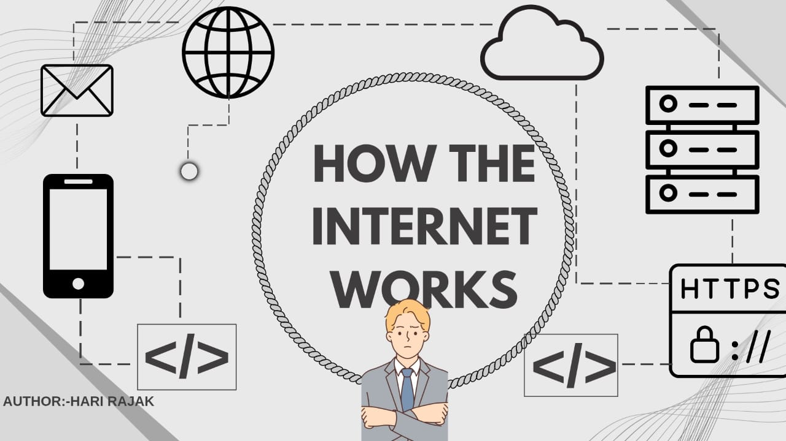
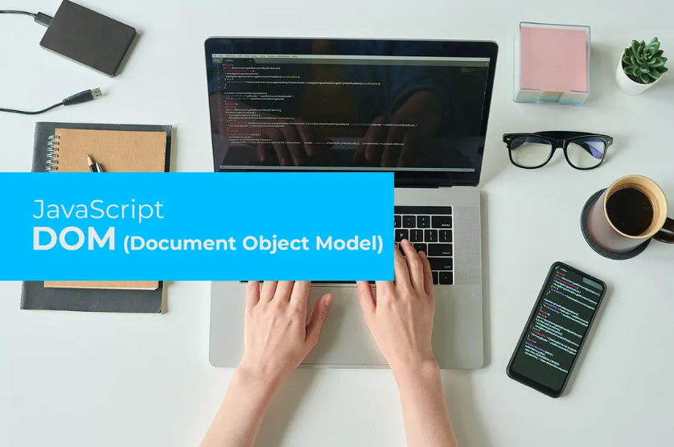
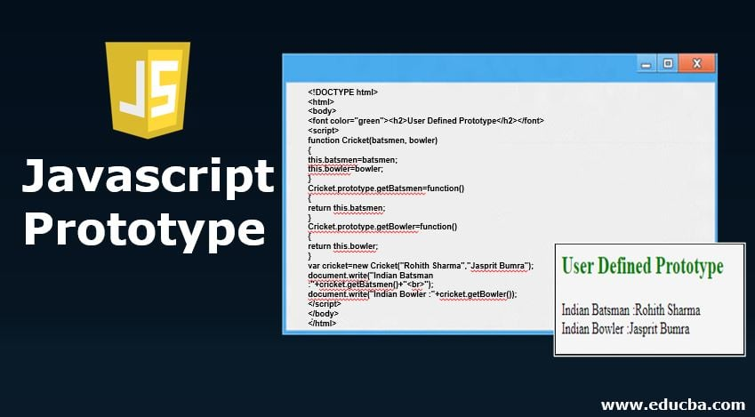

<a href="https://hashnode.com/6835d09c01fd0876c3c66df8/dashboard">
  <h1 align="center">Blogs Archive</h1>
</a>

  Showcase of my journey to building a solid Foundation.

&nbsp;&nbsp;

 

### [The Internet Unplugged: How Your Cat Videos Travel the World in a Flash](https://harry1414.hashnode.dev/the-internet-unplugged-how-your-cat-videos-travel-the-world-in-a-flash)

  <a href="https://harry1414.hashnode.dev/the-internet-unplugged-how-your-cat-videos-travel-the-world-in-a-flash">
      

      
    

  </a>

 

### [HTML for Beginners: Building the Skeleton of a Webpage](https://harry1414.hashnode.dev/html-for-beginners-building-the-skeleton-of-a-webpage)

  <a href="https://harry1414.hashnode.dev/html-for-beginners-building-the-skeleton-of-a-webpage">
      

      
    
 
  </a>

 .

### [Mastering JavaScript: The Art of Debouncing and Throttling for Optimal Performance](https://harry1414.hashnode.dev/mastering-javascript-the-art-of-debouncing-and-throttling-for-optimal-performance)

  <a href="https://harry1414.hashnode.dev/mastering-javascript-the-art-of-debouncing-and-throttling-for-optimal-performance">
      

      
    

  </a>

 

### [JWT Authentication in Node.js: A Practical Guide](https://harry1414.hashnode.dev/jwt-authentication-in-nodejs-a-practical-guide)

  <a href="https://harry1414.hashnode.dev/jwt-authentication-in-nodejs-a-practical-guide">
      

      
    

  </a>

 

 

### [Using Prisma as an ORM in Node.js for SQL Databases](https://harry1414.hashnode.dev/using-prisma-nodejs-sql-databases)

  <a href="https://harry1414.hashnode.dev/using-prisma-nodejs-sql-databases">
      

      
    

  </a>

 

 

### [REST API Design Made Simple with Express.js](https://harry1414.hashnode.dev/rest-api-design-made-simple-with-expressjs)

  <a href="https://harry1414.hashnode.dev/rest-api-design-made-simple-with-expressjs">
      

      
    

  </a>

 

### [How to Create Forms in HTML a beginers guide](https://harry1414.hashnode.dev/how-to-create-forms-in-html-a-beginners-guide)

  <a href="https://harry1414.hashnode.dev/how-to-create-forms-in-html-a-beginners-guide">
      

      
    

  </a>

 

 

### [Understanding Flexbox: Aligning and Distributing Items Easily](https://harry1414.hashnode.dev/understanding-flexbox-aligning-and-distributing-items-easily)

  <a href="https://harry1414.hashnode.dev/understanding-flexbox-aligning-and-distributing-items-easily">
      

      
    

  </a>

 

 

### [Understanding the CSS Box Model: Margins, Borders, and Padding](https://harry1414.hashnode.dev/understanding-the-css-box-model-margins-borders-and-padding)

  <a href="https://harry1414.hashnode.dev/understanding-the-css-box-model-margins-borders-and-padding">
      

      
    

  </a>

 

 

### [Function Declaration vs Function Expression: What’s the Difference?](https://harry1414.hashnode.dev/function-declaration-vs-function-expression-whats-the-difference)

  <a href="https://harry1414.hashnode.dev/function-declaration-vs-function-expression-whats-the-difference">
      

      
    

  </a>

 

 

### [Understanding Variables and Data Types in JavaScript](https://harry1414.hashnode.dev/understanding-javascript-variables-and-data-types)

  <a href="https://harry1414.hashnode.dev/understanding-javascript-variables-and-data-types">
      

      
    

  </a>

 

 

### [Understanding the JavaScript DOM: A Beginner’s Guide to the Document Object Model ]()

  <a href="https://harry1414.hashnode.dev/understanding-the-javascript-dom-a-beginners-guide-to-the-document-object-model">
      

      
    

  </a>

 

 

### [The Prototype Chain in JavaScript: Understanding Inheritance and Object Lookup ]()

  <a href="https://harry1414.hashnode.dev/the-prototype-chain-in-javascript-understanding-inheritance-and-object-lookup">
      

      
    

  </a>

 

 

### [Setting Up Your First Node.js App Step-by-Step]()

  <a href="https://harry1414.hashnode.dev/setting-up-your-first-nodejs-app-step-by-step">
      

      
    

  </a>

 

br>

### [How Node.js Handles Multiple Requests Using a Single Thread ?]()

  <a href="https://harry1414.hashnode.dev/how-nodejs-handles-multiple-requests-using-a-single-thread?showSharer=true">
      

      
    

  </a>

 

br>

### [Understanding the Virtual DOM and JSX]()

  <a href="https://aboutreact.hashnode.dev/understanding-the-virtual-dom-and-jsx?showSharer=true">
      

      
    

  </a>

 
br>

### [Understanding React Hooks:The useState and UseEffect Fundamentals.]()

  <a href="https://aboutreact.hashnode.dev/understanding-react-hooks-the-usestate-and-useeffect-fundamentals?showSharer=true">
      

      
    

  </a>

 
## Contributing..
Contributions are always welcome! Welcome

See [CONTRIBUTING.md](../CONTRIBUTING.md) for ways to get started.
  
