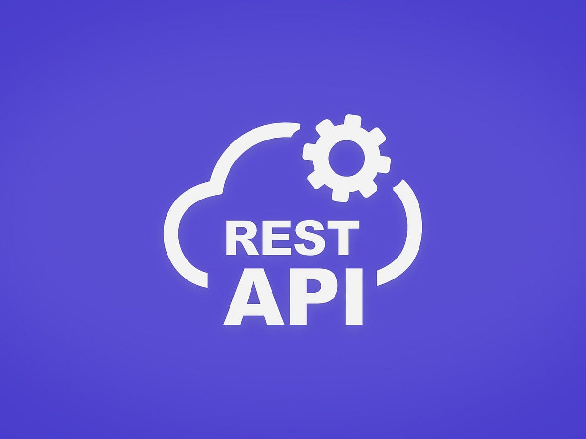

<a href="https://hashnode.com/6835d09c01fd0876c3c66df8/dashboard">
  <h1 align="center">Blogs Archive</h1>
</a>

  Showcase of my journey to building a solid Foundation.

&nbsp;&nbsp;

 

### [The Internet Unplugged: How Your Cat Videos Travel the World in a Flash](https://harry1414.hashnode.dev/the-internet-unplugged-how-your-cat-videos-travel-the-world-in-a-flash)

  <a href="https://harry1414.hashnode.dev/the-internet-unplugged-how-your-cat-videos-travel-the-world-in-a-flash">
      

      
    

  </a>

 

### [HTML for Beginners: Building the Skeleton of a Webpage](https://harry1414.hashnode.dev/html-for-beginners-building-the-skeleton-of-a-webpage)

  <a href="https://harry1414.hashnode.dev/html-for-beginners-building-the-skeleton-of-a-webpage">
      

      
    
 
  </a>

 

### [Mastering JavaScript: The Art of Debouncing and Throttling for Optimal Performance](https://harry1414.hashnode.dev/mastering-javascript-the-art-of-debouncing-and-throttling-for-optimal-performance)

  <a href="https://harry1414.hashnode.dev/mastering-javascript-the-art-of-debouncing-and-throttling-for-optimal-performance">
      

      
    

  </a>

 

### [JWT Authentication in Node.js: A Practical Guide](https://harry1414.hashnode.dev/jwt-authentication-in-nodejs-a-practical-guide)

  <a href="https://harry1414.hashnode.dev/jwt-authentication-in-nodejs-a-practical-guide">
      

      
    

  </a>

 

 

### [Using Prisma as an ORM in Node.js for SQL Databases](https://harry1414.hashnode.dev/using-prisma-nodejs-sql-databases)

  <a href="https://harry1414.hashnode.dev/using-prisma-nodejs-sql-databases">
      

      
    

  </a>

 

 

### [REST API Design Made Simple with Express.js](https://harry1414.hashnode.dev/rest-api-design-made-simple-with-expressjs)

  <a href="https://harry1414.hashnode.dev/rest-api-design-made-simple-with-expressjs">
      

      
    

  </a>

 

## Contributing

Contributions are always welcome!

See [CONTRIBUTING.md](../CONTRIBUTING.md) for ways to get started.
  
